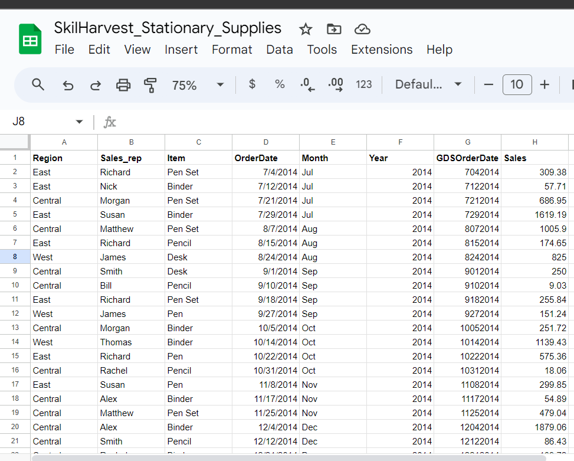

# Google_Query_Project
                                                                    
**Documentation Outline**
- [Project Overview](Project_Overview)
- [Data Sources](Data-Sources)
- [Tools Used](Tools-Used)
- [Data Cleaning and Preparation](Data-Cleaning-and-Preparation)
- [Data Analysis](Data-Analysis)
- [Results and Findings](Results-/-Findings)
- [Recommendations](Recommendations)

## Project Overview
This data looks at Google Query which was the first module treated at the SkilHarvest Data Analysis class.
What is Google Query?
Google Query is like a magical treasure chest for numbers and words.

-- What does it do?
- It helps you find answers to tricky questions about data.
- You tell it what you want, and it digs through piles of information to find just the right stuff.
- It's like having a super-smart detective friend who knows where to look!
- Google Query is like a secret code that unlocks hidden knowledge.

## Data Sources
- The data used was provided by the SkilHarvest Intsructor, Mr. TeeDee
- Here is pictorial view of the cross-section of the data
  
  

  ## Tools Used
  - Excel sheet [Download Here](

