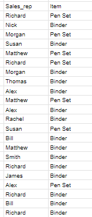
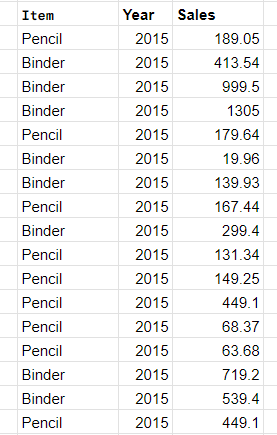
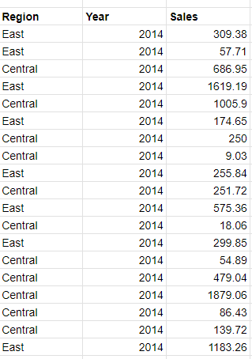
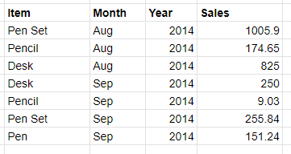
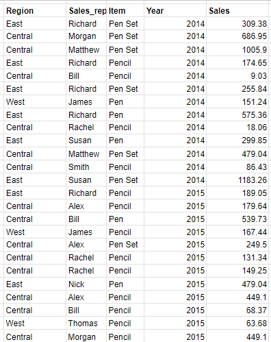
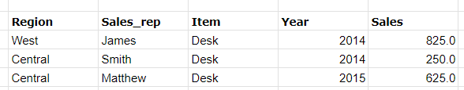

# Google_Query_Project
---
                                                                    
**Documentation Outline**
- [Project Overview](Project_Overview)
- [Data Sources](Data-Sources)
- [Tools Used](Tools-Used)
- [Data Cleaning and Preparation](Data-Cleaning-and-Preparation)
- [Results and Findings](Results-and-Findings)
- [Recommendations](Recommendations)

## Project Overview
---
This data looks at Google Query which was the first module treated at the SkilHarvest Data Analysis class.
What is Google Query?
Google Query is like a magical treasure chest for numbers and words.

*What does it do?*
- It helps you find answers to tricky questions about data.
- You tell it what you want, and it digs through piles of information to find just the right stuff.
- It's like having a super-smart detective friend who knows where to look!
- Google Query is like a secret code that unlocks hidden knowledge.

## Data Sources
---
- The data used was provided by the SkilHarvest Intsructor, Mr. TeeDee
- Here is pictorial view of the cross-section of the data
  
  

## Tools Used
---
- Excel sheet [Download Here](SkilHarvest_Stationary_Supplies.csv)

## Data Cleaning and Preparation
---
- Data cleaning is the process of fixing or removing incorrect, corrupted, incorrectly formatted, duplicate, or incomplete data within a dataset
- Clean data ensures that the data analysed is consistent and can be analysed accurately
- The data used was clean and then analysed
- Data transformation occured in PowerBi

## Results and Findings
---
- The questions and answers from the data set is as listed below:
1. Show Sales rep of binder items and pencil
   
```
=QUERY(A:H, "SELECT B, C WHERE C = 'Pen Set' OR C = 'Binder' ", 1)
```



2. Show sales of binder items and pencil in 2015

```
=QUERY(A:H,"SELECT C,F,H WHERE (C = 'Binder' OR C = 'Pencil') AND F = 2015",1)
```



3. Sales in Central and East region in 2014

```
=QUERY(A:H, "SELECT A,F,H WHERE (A = 'East' OR A = 'Central') AND F = 2014", 1)
```



4. Sales in August and September 2014

```
=QUERY(A:H, "SELECT C,E,F,H WHERE (E = 'Aug' OR E = 'Sep') AND F = 2014 ", 1)
```



5. Show sales of items that start with Pen, include their region, sales rep and year

```
=QUERY(A:H, "SELECT A, B, C, F, H WHERE C LIKE 'Pen%' ", 1)
```



6. Show sales of items that end with ‘sk’, include their region, sales rep and year

```
=QUERY(A:H, "SELECT A, B, C, F WHERE C LIKE '%sk' ", 1)
```



